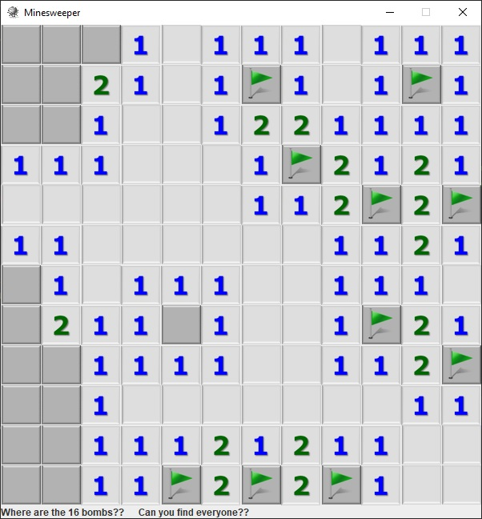

# Minesweeper Windows Application
A sample Windows-game "Minesweeper" wrote on Java

**How to run?**
You can run it from the dist folder - by running "minesweeper.exe" or "minesweeper.jar" file - both of them works without anything else. Just run by clicking mouse.

**How to play?**
The rules are generally similar to the native Windows game. 
* By clicking right mouse button you can open the field cell 
1. If there is a empty cell - it will open all around empty cells/
1. If there is a bomb in cell - it will finished the game and write the message about it bellow
1. If there is a digit in cell - thats shows "how many mines there are near this cell" (on vertical, horizontal and diagonal directions)
1. If you clicked right button on a "digit cell" another one time, if it's possible - it will open another cells with digits
* By clicking left mouse button you can put the "flag" to the field cell
* If you will find all 16 mines (on the field 10x10), the game will be finished, and show the small message with congrats bellow.
* For restart the game - click the middle mouse button.

**Can I see how it works?**

* Starting the Game:

* Game process:

* Game Over (Win):

* Game Over (Lose):

Version 1.0
**Technologies and principles used**
* OOP, Java, Swing

